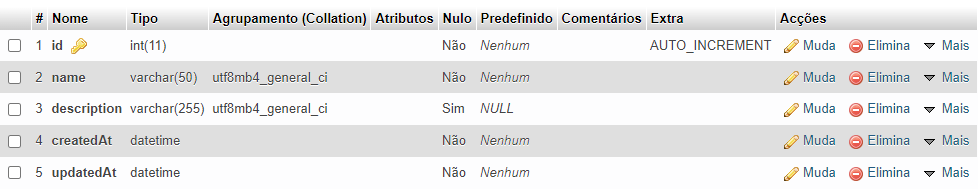
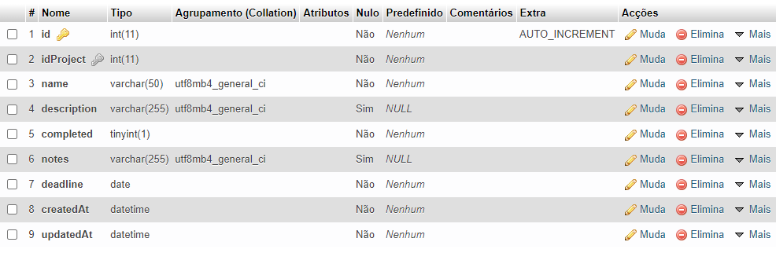
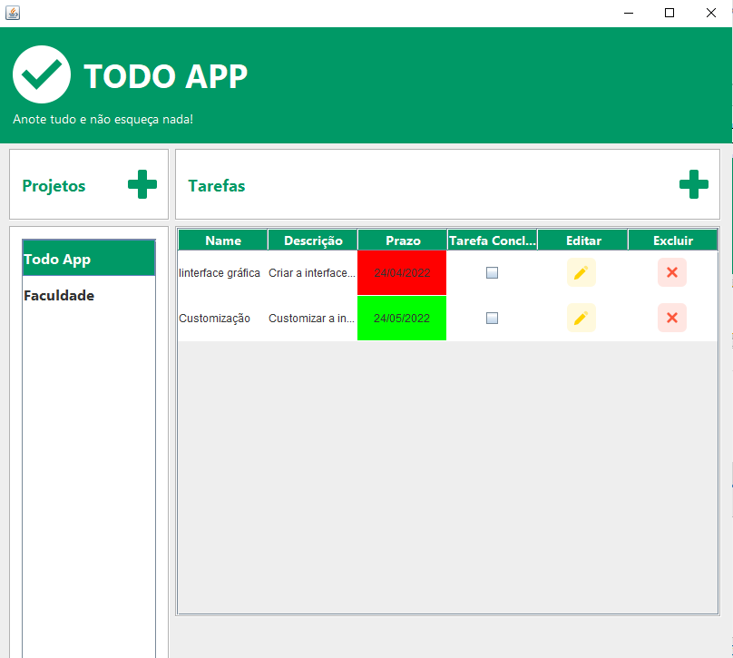

# JAVA

This repository contains the projects made during the full-stack Java Course offered by Capgemini.

## [Todo App](https://github.com/paola-yumi-m/JAVA/blob/main/todoApp/app/src/main/java/todoApp/App.java)

This program consists of a Main Screen, where you can view every task for every project added.
It is also possible to add new projects and tasks, as well as edit and delete the existing tasks.
The data is stored in a MySQL database. The sctructure for the Projects table and the Tasks table is presented below:

.

.

This is an example of the Main Screen:

.

